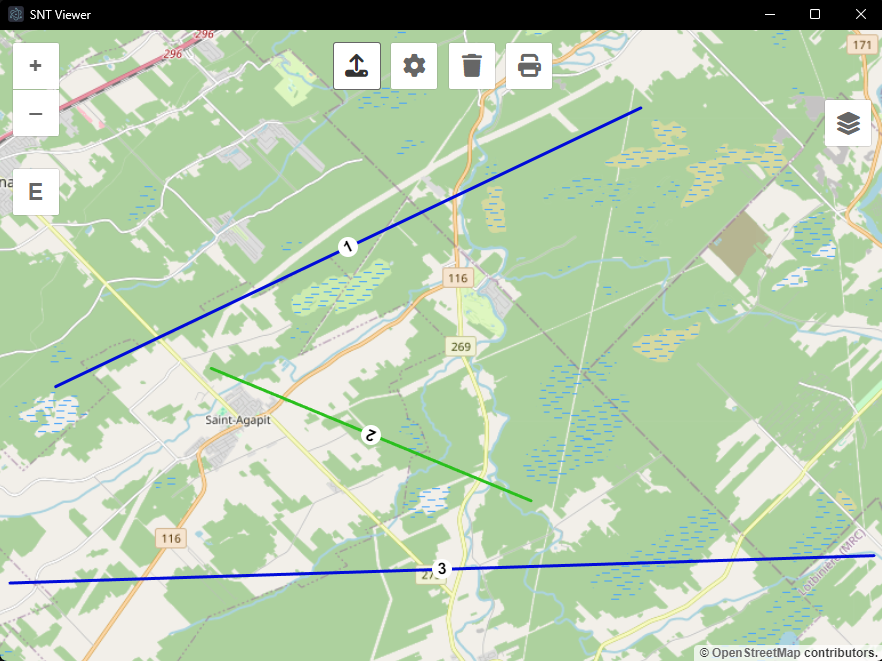

# SNT Viewer App

Application pour visualiser facilement les planifications en format SNT (voir [DEMO.SNT](DEMO.SNT))

Site web: https://snt-view.web.app

Application bureau: https://github.com/mathouqc/SNT-Viewer/releases/latest



## Frameworks

- **Javascript** pour programmer l'application
- **OpenLayers** pour l'affichage de la carte
- **Electron-vite** pour développer l'application bureau

## Project Setup

### Install

```bash
npm install
```

### Development

```bash
npm run dev
```

### Build

```bash
npm run build:win
```

## Project Deploy

```bash
firebase deploy
```
